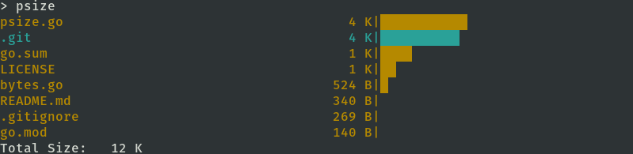

# psize

[](https://goreportcard.com/report/github.com/mloo3/psize)

CLI tool for checking size of folders.

## Install

```
export PATH=$PATH:$(go env GOPATH)/bin
go get -u github.com/mloo3/psize
```

## Usage

```
psize [flags] [directory]
```

### Example


### Flags
Usage of psize:
```
  -c int
    	shows count number of files (default 10)
  -count int
    	shows count number of files (default 10)
  -d	do not shows size of directories
  -dirsize
    	do not shows size of directories
  -r	shows files in ascending order
  -reverse
    	shows files in ascending order
  -v	prints version
  -version
    	prints version
```
